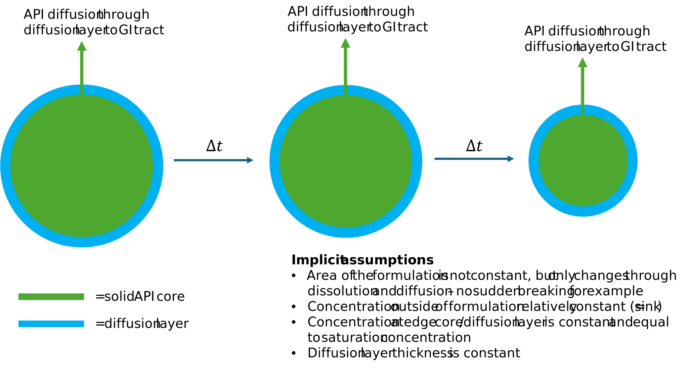
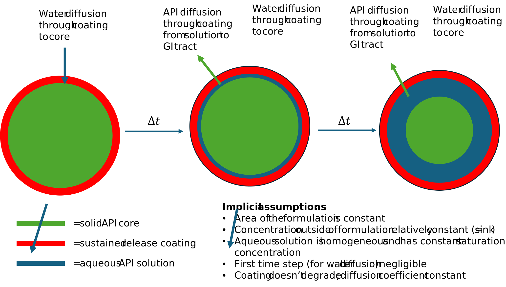

# Introduction

Welcome to the PK simulation app! This app was developed for teaching purposes, so students can investigate the effect of different formulation properties on the pharmacokinetics of sustained release and immediate release formulations. It includes two graphs: API concentration in the GI tract and blood. As of now, it also contains two formulation options: immediate release and sustained release (coated reservoir). The app itself is rather self-explanatory and does not require a tutorial, but going into the mathematical background is necessary for the user wishing to fully understand it. This being said, it's useful to mention that all plots can be downloaded by hovering over the plot and clicking the camera on the top right.

It must be noted that although the graphs can show overlays, the model assumes that the two formulations are taken in a completely independent matter. In other words: although two curves are visible, the model thinks that only one formulation in present in the GI tract and calculates the two curves completely separately. The model overlays curves for comparison, but does not represent what a combination of these formulations would look like.

Since this is a teaching app, the models have limitations. They were not validated (although both input parameters and outcomes are realistic) and are also not as mathematically thorough as commercial models such as Gastroplus or Simcyp. For instance, the present model treats the GI tract (mainly the small intestine) as a tube without peristalsis (although the sustained release formulation gets removed after some time). A more accurate model would contain different GI tract segments, each with their own lumen permeability, lumen surface area, and pH. Furthermore, mathematically speaking, an ideal model would have a system of many differential equations that are solved numerically. The current model does not do this, and instead relies on a closed form solution for the sustained release and a simpler numerical model for the immediate release.

The aim of this text is to supplement you with more theoretical explanation to explain how this app works.

 

## Derivation of the model for the immediate release formulation

For the derivation of this model, we will base ourselves on a variation of the Hixson-Crowell cubic root equation. We start by writing the Noyes-Whitney equation, which is itself based on Fick's first law of diffusion (see later):

$$
\frac{dM}{dt} = \frac{DS}{h}(C_s-C). \quad (1.1)
$$

An important note to make is that the Noyes-Whitney equation does not take into account the shrinking of the formulation as it dissolves. We can take this into account by replacing the surface area by an expression in function of weight. The situation is summarised in figure 1.1. 

 

<figure style="text-align:center;">

<figcaption style="font-style:italic;">

Figure 2.1: Schematic of the immediate-release formulation.

</figcaption>

</figure>

 

The total weight in of a sphere is:

$$
M_s(t) = \rho V(t) = \rho \frac{4}{3} \pi rt(t)^3 => r(t) = (\frac{3M_s}{4\rho \pi })^{\frac{1}{3}}  \quad (1.2)
$$

The surface of a sphere is given by:

$$
S = 4 \pi r^2 => r(t) = (\frac{S}{4 \pi})^{\frac{1}{2}} \quad (1.3)
$$

Solving for r in both equations and setting them equal to each other results in:

$$
(\frac{S(t)}{4 \pi})^{\frac{1}{2}} = (\frac{3M_s(t)}{4\rho\pi})^{\frac{1}{3}} => S(t) = 4\pi(\frac{3M_s}{4\rho\pi})^{\frac{2}{3}} \quad (1.4)
$$

If we consider M to be the amount that is in solution, we can substitute C in eqution 1.4 by $\frac{M}{V_{GI}}$. We also need to consider that the weight of the sphere $M_s(t)$ can be expressed by the amount at $t = 0$, $M_0$, minus the amount in solution, $M(t)$. Substituting everything back into equation 1.1, we obtain:

$$
\frac{dM}{dt} = 4\pi\frac{D}{h}(\frac{3}{4\rho\pi})^{\frac{2}{3}} (M_0-M)^{\frac{2}{3}} (C_s-\frac{M}{V_{GI}}). \quad (1.5)
$$

In order to simplify the equation before integrating it, we define:

$$
K = 4\pi \frac{D}{h}(\frac{3}{4\rho\pi})^{\frac{2}{3}} \quad (1.6)
$$

and thus,

$$
\frac{dM}{dt} = C_sK(M_0-M)^{\frac{2}{3}} - \frac{K}{V_{GI}}(M_0-M)^{\frac{2}{3}}M.  \quad (1.7)
$$

Equation 1.7 can be solved through a series of substitutions and partial fraction decomposition, but a full derivation is beyond the scope of this text. The result is:

$$
\frac{V_{GI} \left(\ln\left(\left|\left(M - M_{0}\right)^{\frac{2}{3}} + \sqrt[3]{C_{s} V_{GI} - M_{0}} \sqrt[3]{M - M_{0}} + \left(C_{s} V_{GI} - M_{0}\right)^{\frac{2}{3}}\right|\right) - 2 \ln\left(\left|\sqrt[3]{M - M_{0}} - \sqrt[3]{C_{s} V_{GI} - M_{0}}\right|\right) + 2 \sqrt{3} \arctan\left(\frac{2 \sqrt[3]{M - M_{0}} + \sqrt[3]{C_{s} V_{GI} - M_{0}}}{\sqrt{3} \sqrt[3]{C_{s} V_{GI} - M_{0}}}\right)\right)}{2K \left(C_{s} V_{GI} - M_{0}\right)^{\frac{2}{3}}} + C = t. \quad (1.8)
$$

Based on this, it is clear that no simple expression for M(t) can be obtained. Furthermore, proceeding in an analytical manner would require further algebra, making everything algebraiecally complex and computationally slow. Hence, it is actually more efficient to solve a system of two differential equations numerically, namely:

$$
\frac{dC_{GI}}{dt} = \frac{1}{V_{GI}}C_sK(M_0-M)^{\frac{2}{3}} - \frac{K}{V_{GI}^2}(M_0-M)^{\frac{2}{3}}M - \frac{P_{eff}A}{V_{GI}}(C_{GI}), \quad (1.9)
$$

which is simply equation 1.7 divided by $V_{GI}$ and with the added term $\frac{P_{eff}A}{V_{GI}}(C_{GI})$ representing absorption through the intestinal lumen. The second differential equation is:

$$
\frac{dC_{plasma}}{dt} = \frac{P_{eff}A}{V_d} C_{GI}-\frac{Cl}{Vd}C_{plasma} \quad (1.10)
$$

The numerical evaluation is done within R and is not explained further here. Note that the approach used here implicitly handles the emptying of the IR formulation. Indeed, if \$M = M_0\$ in equation 1.9, the change in GI concentration in time is just controlled by diffusion into the bloodstream. Note that this approach is different from the one used for the sustained release model below because the equations are very different. Gastric emptying, on the other hand, is not taken into account here because we assume that the drug is relatively water soluble and thus dissolves and diffuses entirely before the formulation is removed with the feces. This is not necessarily the case for an SR formulation if the coating is not permeable enough, which is described below.

 

## Derivation of the model for the coated reservoir sustained release formulation

The dosage form that is modeled in this case is a coated reservoir system. All diffusion problems must be approached from the Fick's second law, initially:

$$
\frac{\delta C}{\delta t} = D\frac{\delta^2 C}{\delta x^2} \quad (2.1)
$$

This is a second order partial differential equation, and quite hard to solve. Fortunately, if we consider the concentrations inside and outside of the formulation to be nearly constant (in other words, we assume sink conditions for the concentration in the GI tract), we can make the assumption that $\frac {\delta C}{\delta t} ≈ 0$. This means that the right hand side of Fick's law is also equal to zero, which means that $\frac {\delta C}{\delta x} = k$ and thus that $C(x) = kx+b$. A full model would include two steps. First, the diffusion of water to the inside of the formulation, dissolving the API. Second, the diffusion of the API to the outside of the coating. The model presented here simplifies this scenario by presuming that step 1 is near instantaneous and only models step 2.

Essentially, the whole situation reduces to figure 2.1 below, which can be easily modeled through Fick's first law of diffusion (equation 2.2).

 

<figure style="text-align:center;">

<figcaption style="font-style:italic;">

Figure 2.1: Schematic of the sustained-release formulation.

</figcaption>

</figure>

 

$$
\frac{dM_{GI}}{A dt} = -D\frac{C_{{GI},\ film}-C_{formulation,\ film}}{\Delta x} \quad (2.2)
$$

To remove the "film" subscript, we need to include a term that takes into account the partition of the API into the film and the aqueous medium. This can be done through the equilibrium constant $K = \frac{Concentration\ in\ film}{Concentration\ outside\ of\ film}$. Moreover, to solve the differential equation, $dM_{GI}$ is transformed into $C_{GI}$ by using the volume in the GI $V_{GI}$. Finally, A is moved to the other side, $C_{formulation}$ is set equal to the equilibrium concentration $C_{sat}$ and $\Delta x$ is just the thickness of the film $(h)$. Based on this, we have:

$$
\frac{dC_{GI}}{dt} = -\frac{DKA}{hV_{GI}}(C_{GI}-C_{sat}) \quad (2.3)
$$

This will be the contribution from the dosage form to the total GI tract concentration. A very similar expression can be used to determine the drug disappearing from the GI tract due to absorption:

$$
\frac{dC_{GI}}{dt} = \frac{P_{eff}A}{V_{GI}}(C_{plasma}- C_{GI}) \quad (2.4)
$$

Now, in order to avoid a system of differential equations (which would result in more complicated math), let's assume that $C_{plasma} << C_{GI}$, and hence that the $C_{plasma}$ in the parentheses above can be neglected. Based on this, we get a relatively simple expression for $\frac{dC_{GI}}{dt}$:

$$
\frac{dC_{GI}}{dt} = \frac{DKA}{hV_{GI}}(C_{sat}-C_{GI}) - \frac{P_{eff}A}{V_{GI}}(C_{GI}) \quad (2.5).
$$

This differential equation is solvable through separation of variables. Renaming $\frac{DKA}{hV_{GI}}$ as $k_s$ and $\frac{P_{eff}A}{V_{GI}}$ as $k_a$, we can write:

$$
\frac{dC_{GI}}{k_sC_{sat}-k_sC_{GI}-k_aC_{GI}} = dt \quad (2.6).
$$

This can be solved by performing a u-substitution by setting the whole denominator equal to u. Solving the resulting equation with boundary conditions $C_{GI} = 0 \ if \  t = 0$ and $C_{GI} = C(t)_{GI} \ if \  t = t$ gives:

$$
C_{GI}(t) = \frac{k_SC_{sat}-k_sC_{sat}e^{-(k_a+k_s)t}}{k_s+k_a} \quad (2.7).
$$

The problem with the approach so far is that it does not consider the dosage form emptying. The release will keep increasing as long as the concentration in the GI tract is below the saturation concentration. Furthermore, the dosage form might exit the GI tract before release is complete. The first issue is solved by determining the time at which the dosage form is empty based on the equations above. The second issue is solved by comparing the time required to empty the dosage form with a certain GI transit time (that can be picked by you). As soon as either time is reached (whichever is smaller), the release from the formulation is set to zero, and thus:

$$
\frac{dC_{GI}}{dt} = - \frac{P_{eff}A}{V_{GI}}(C_{GI}) \quad (2.8),
$$

which is just first order elimination. The boundary conditions for this differential are a little more complex, since at $t = 0$, the concentration is now $C_{GI}(transit \  time)\  or\  C_{GI}(empty \  dosage \  form \  time)$ The calculation of the time required to empty the dosage form is a little more complex. Essentially, equation 7 is plugged into equation 2 and the resulting equation is solved using similar methods as before. One obtains the following expression for the mass of drug left, where D is the initial dose in the formulation, and $k'_s = k_sV_{GI}$:

$$
M(t) = D - t k_s' C_{sat} + t \frac{k_s' k_s C_{sat}}{k_a + k_s} + \frac{k_s' k_s C_{sat} e^{-(k_a+k_s)t}}{(k_a+k_s)^2} + \frac{k_s' k_s C_{sat}}{(k_a+k_s)^2} \quad (2.9)
$$

The time required to empty the dosage form can then be obtained by setting $M(t) = 0$ and determining $t$. This can not be done easily analytically, and is thus solved numerically.

Finally, the plasma concentration is obtained by the equation:

$$
\frac{dC_{plasma}}{dt} = \frac{P_{eff}A}{V_d} C_{GI}-\frac{Cl}{Vd}C_{plasma} \quad (2.10)
$$

where Cl is the clearance. Again, the assumption is made here that the plasma concentration is much smaller than the concentration in the GI tract. If $C_{GI}$ in equation 10 is replaced by the expression from equation 7, the differential equation can again be solved using separation of variables and u-substitution. The resulting final equation is:

$$
C_{plasma}(t) = \frac{P_{eff} A} {Cl} \frac{k_SC_{sat}-k_sC_{sat}e^{-(k_a+k_s)t}}{k_s+k_a}-\frac{P_{eff} A} {Cl} \frac{k_SC_{sat}-k_sC_{sat}e^{-(k_a+k_s)t}}{k_s+k_a}e^{-\frac{Cl}{V_d}t} \quad (2.11).
$$
